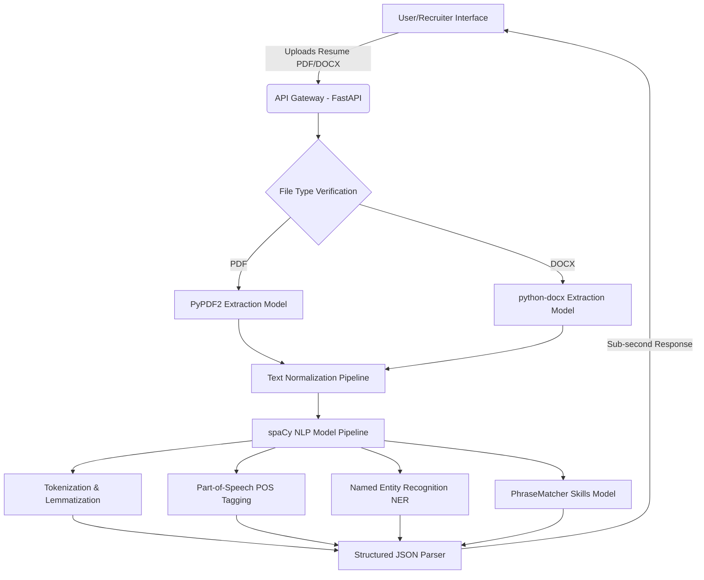

# CHAPTER THREE: RESEARCH METHODOLOGY

## 3.1 Introduction
The research methodology employed in the development of the system is designed to create a robust, automated framework for parsing and analyzing professional documents, with a primary focus on **Automatic Skill Extraction from Resumes using Natural Language Processing Models**. This study details a systematic approach to transforming unstructured resume text into structured professional profiles. By utilizing specialized tokenizers, part-of-speech (POS) tagging models, dependency parsing, phrase matchers, and Named Entity Recognition (NER) models, the proposed system extracts technical skills, candidates' contact details, professional experience entities, and key phrases in under a second. The methodology focuses on local, deterministic processing, ensuring candidate data privacy and absolute operational efficiency.

---

## 3.2 Analysis of the Existing System
Conventional resume screening is heavily reliant on manual review by human resource personnel or basic keyword search engines. While human review is detailed, it is increasingly inadequate in high-volume hiring environments.

### 3.2.1 Limitations of the Existing System
*   **High Cognitive Load:** Reviewing hundreds of resumes daily leads to recruiter fatigue, oversights, and inconsistent evaluation.
*   **Inconsistency and Bias:** Human selection can be subjective. The same resume might be graded differently depending on the reviewer's background or the time of evaluation.
*   **Basic Keyword Matching Failures:** Simple string-search utilities often fail to identify context (e.g., separating a skill listed as "developed Python applications" from "managed python snake enclosures").
*   **API Security & Privacy Violations:** Modern cloud-based Generative AI tools (LLMs) leak personally identifiable information (PII) to external servers, violating data compliance frameworks like GDPR and NDPR.

---

## 3.3 Overview of the Proposed System
The proposed system is a privacy-first web application designed for **Automatic Skill Extraction from Resumes using Natural Language Processing Models**. The architecture processes PDF and DOCX documents locally, parses their raw text, and feeds it into a pipeline of specialized NLP models to isolate skills, categorize candidate details, and calculate job description alignment scores.

### 3.3.1 Objectives of the Proposed System
*   **Automatic Text Extraction:** Develop a pipeline to automatically extract and clean text from unstructured PDF and DOCX files.
*   **Natural Language Processing Models Integration:** Design a modular NLP pipeline leveraging tokenization, POS tagging, and NER models to extract names, emails, phones, locations, and dates.
*   **Lexical Phrase Matching Model:** Implement a custom dictionary-based PhraseMatcher model using a curated skills knowledge base to capture technical and soft skills.
*   **Dynamic Role Alignment Model:** Build a client-side classification model to evaluate the candidate's extracted skills against target industry roles in real time.
*   **Data Privacy and Cost Efficiency:** Deploy a completely local parser that operates with sub-second latency and zero external API dependencies.

---

## 3.4 System Architecture and Design
The system is constructed using a decoupled three-tier architecture: the **Presentation Layer**, the **API/Controller Layer**, and the **NLP Engine Layer**.

### 3.4.1 Architectural Layout


1.  **Presentation Layer (Next.js & Tailwind CSS):** A responsive, client-side dashboard that manages drag-and-drop file uploads, displays extracted skills, provides interactive target role selection, and executes real-time job description alignment.
2.  **API Layer (FastAPI):** A high-performance Python framework that handles document routing, parses files to text, and serves JSON payloads.
3.  **NLP Engine Layer (spaCy):** A pipeline of specialized natural language processing models that perform linguistic annotations, semantic filtering, entity recognition, and dictionary-based phrase matches.

---

## 3.5 Natural Language Processing Models and Engine
The central component of the project is the NLP engine, which integrates multiple models to process resume text.

```
+-----------------------------------------------------------------+
|                      Raw Resume Text Block                      |
+-----------------------------------------------------------------+
                                 |
                                 v
+-----------------------------------------------------------------+
|                       Tokenization Model                        |
|        (Segments text strings into individual word tokens)      |
+-----------------------------------------------------------------+
                                 |
                                 v
+-----------------------------------------------------------------+
|                 Part-of-Speech (POS) Tagging                    |
|      (Identifies Nouns, Verbs, Adjectives, Proper Nouns)        |
+-----------------------------------------------------------------+
        /                        |                        \
       v                         v                         v
+--------------+        +-----------------+        +--------------+
|  NER Model   |        |  PhraseMatcher  |        | Noun Chunk   |
| (PERSON,ORG, |        |   Skills Model  |        | Parsing Model|
|  GPE, DATE)  |        | (Matches terms  |        | (Isolates key|
|              |        |  with SKILLS_DB)|        |  phrases)    |
+--------------+        +-----------------+        +--------------+
       \                         |                         /
        \________________________v________________________/
                                 |
                                 v
+-----------------------------------------------------------------+
|             Structured JSON Profile Output Generator            |
+-----------------------------------------------------------------+
```

### 3.5.1 Tokenization and Lemmatization Model
The input text is divided into linguistically meaningful units called *tokens*. Lemmatization is applied to normalize words to their base form (e.g., "developing", "developed", and "develops" are resolved to the lemma "develop"). This prevents duplicate counts and improves matching accuracy.

### 3.5.2 Part-of-Speech (POS) Tagging Model
The POS tagging model assigns grammatical labels (e.g., noun, verb, proper noun, adjective) to each token. The system uses POS tags to isolate noun chunks and descriptive phrases (e.g., "Senior Frontend Engineer") while discarding irrelevant filler words (conjunctions, prepositions).

### 3.5.3 Named Entity Recognition (NER) Model
The system utilizes spaCy's pre-trained transition-based NER model (`en_core_web_sm`) to classify text spans into predefined categories:
*   `PERSON`: Used to extract candidate names.
*   `ORG`: Used to extract employers and universities.
*   `GPE`: Used to identify locations (cities, countries).
*   `DATE`: Used to identify employment durations and graduation dates.

To refine the raw NER model output, custom heuristics are applied:
$$\text{Confidence Score } (C_{\text{ORG}}) = C_{\text{Base}} + \Delta_{\text{Suffix}} + \Delta_{\text{Known}} - \Delta_{\text{Length}}$$
Where:
*   $C_{\text{Base}} = 0.5$
*   $\Delta_{\text{Suffix}} = 0.2$ if organizational suffix exists (e.g., "Ltd", "Inc", "Corp")
*   $\Delta_{\text{Known}} = 0.3$ if company matches our known enterprise database
*   $\Delta_{\text{Length}} = 0.2$ if entity length is under 5 characters (avoiding acronym confusion)

### 3.5.4 PhraseMatcher Model
The core skill-extraction component uses spaCy’s `PhraseMatcher` model. It compiles a dictionary of over 100 industry-standard technical and soft skills (`SKILLS_DB`) and searches the document's token sequence. Because `PhraseMatcher` is token-aware, it successfully extracts multi-word skills (e.g., "Tailwind CSS", "Data Analysis") and matches case-insensitively, avoiding character-level substring match errors (e.g., matching "Java" in "JavaScript").

---

## 3.6 Data Preprocessing and Pipeline Flow
The resume text passes through five sequential stages:
1.  **Text Extraction:** Reading raw binary streams from PDF/DOCX files and resolving to standard UTF-8 text.
2.  **Linguistic Cleaning:** Removing non-standard control character sequences and normalising whitespace.
3.  **Syntactic Annotations:** Running the spaCy language model pipeline to generate tokens, POS tags, and dependency trees.
4.  **Deduplication & Filtering:** Cross-checking extracted ORG and GPE tokens against the `SKILLS_DB` to prevent overlapping classifications (e.g., preventing "React" from being classified as a location or company).
5.  **Heuristic Assembly:** Applying regular expressions (RegEx) to extract email addresses and phone formats, merging them with parsed skills, entities, and noun chunks into a structured profile.

---

## 3.7 Technical Implementation Tools
*   **Python:** Chosen as the primary language due to its advanced, high-performance ecosystem for natural language processing.
*   **spaCy (en_core_web_sm):** The primary NLP library, utilized for tokenization, POS tagging, lemmatization, and NER.
*   **FastAPI:** High-speed ASGI web framework to expose REST endpoints.
*   **Next.js (TypeScript) & Tailwind CSS:** Client-side architecture to build a responsive, dashboard-focused recruiter panel.
